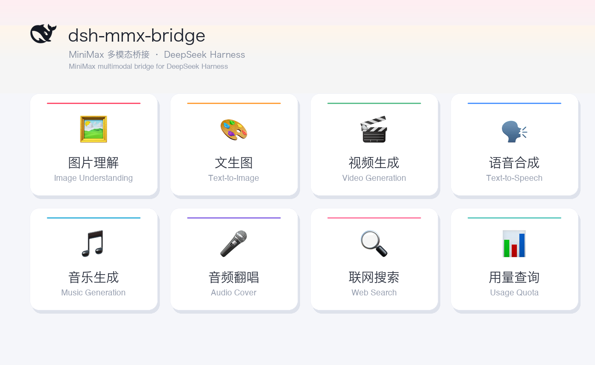
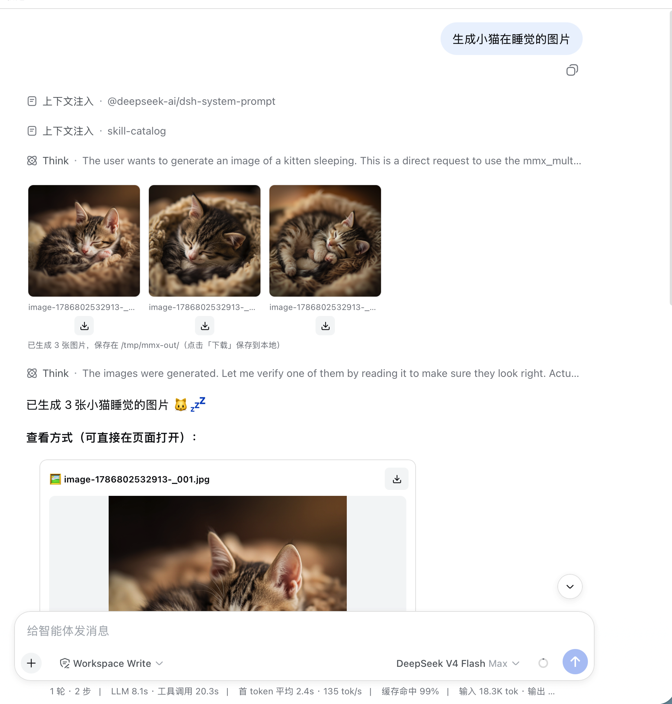
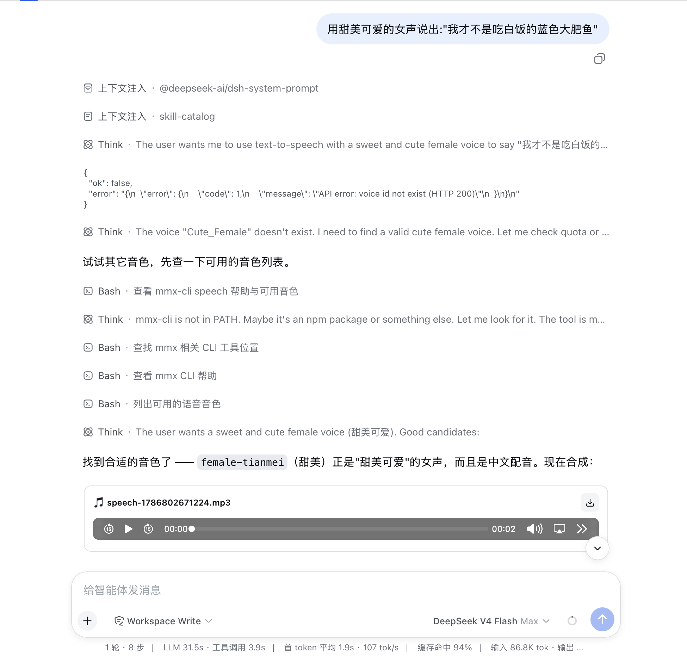
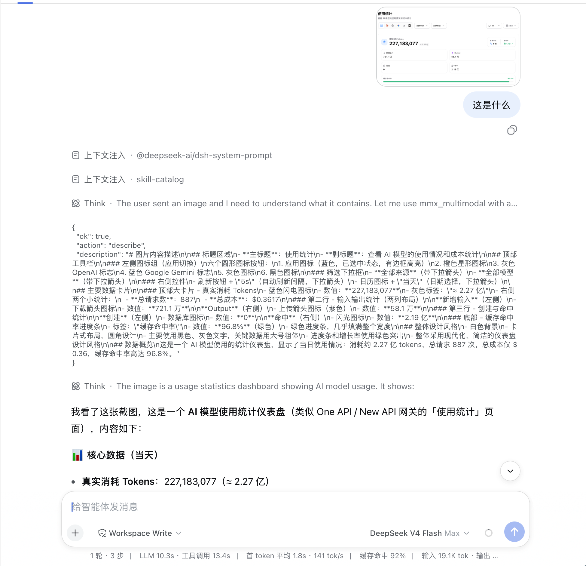
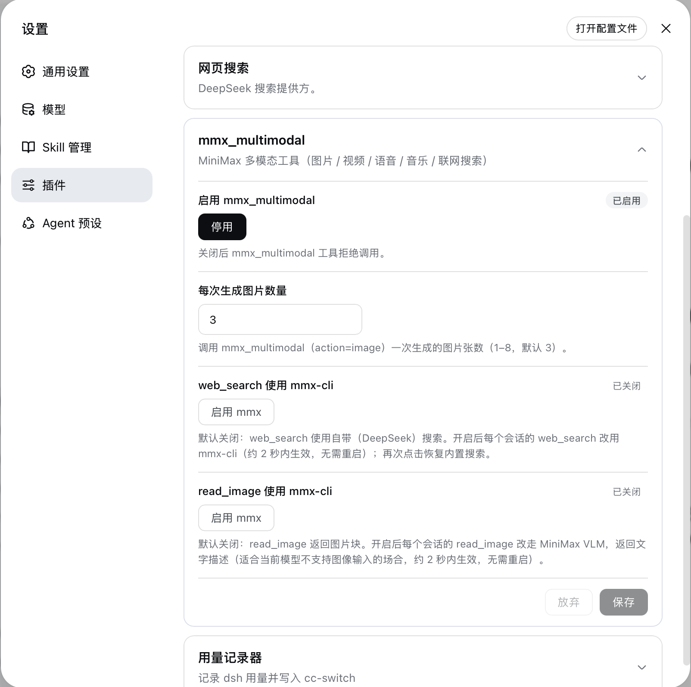

  

# dsh-mmx-bridge

> MiniMax multimodal bridge plugin for [DeepSeek Harness](https://github.com/deepseek-ai/deepseek-harness) (DSH).

 

**English** · [中文 README](README.md)

## Features

One `mmx_bridge` tool covering MiniMax's whole multimodal stack:

- **Image understanding** (describe) · **Text-to-image** (image)
- **Video generation** (video) · **Text-to-speech** (speech)
- **Music generation** (music) · **Audio cover** (cover)
- **Web search** (search) · **Usage quota** (quota)

Generated files are served same-origin at `/mmx-files/` (with Range support); the conversation renders inline image previews and audio/video players, and results carry playable URLs.

  

## Screenshots

| Image generation | Speech synthesis |
| :--: | :--: |
|  |  |

| Image understanding (VLM) | Plugin settings |
| :--: | :--: |
|  |  |

## Install

Copy the prompt below (**the whole block**) to your AI assistant (agent) — it will follow [AGENT.md](AGENT.md) to install, mount and verify:

> Help me install the DSH (DeepSeek Harness) plugin dsh-mmx-bridge, repository: https://github.com/welsione/dsh-mmx-bridge
> 1. First read AGENT.md at the repository root (raw link: https://raw.githubusercontent.com/welsione/dsh-mmx-bridge/main/AGENT.md ) and follow its "安装步骤" (install steps) and "免重启验证" (no-restart verification) sections exactly — do not skip steps.
> 2. Install into the DSH profile I currently use; if unclear, list the profiles under `~/.dsh/profiles/` and ask me (`web` is typical for the Web GUI).
> 3. Prefer `dsh plugin --profile <profile> add dsh-mmx-bridge` (auto-mounts after install; do NOT also edit `cordis.patch.yml`); if the npm registry is unreachable, use `github:welsione/dsh-mmx-bridge`.
> 4. Installation is done once the no-restart checks pass; do **not** restart DSH — hand me the "重启与重启后验证" (restart & post-restart) checklist from AGENT.md section 5.

## Related

[DeepSeek Harness](https://github.com/deepseek-ai/deepseek-harness) · [MiniMax CLI](https://github.com/MiniMax-AI/cli) · [awesome-dsh-plugins](https://github.com/AdamPlatin123/awesome-dsh-plugins)

## License

[MIT](LICENSE)
